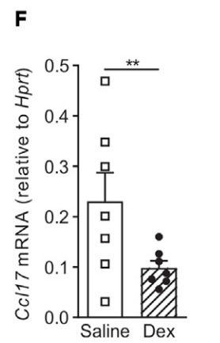
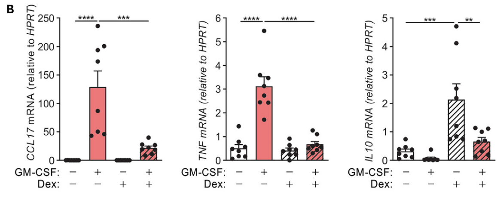
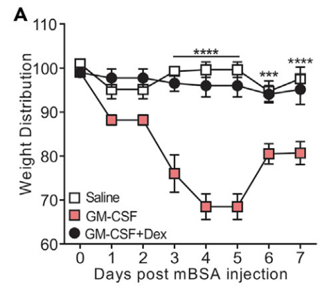

# Student's sleep data: `sleep_study.csv`

### Description

Data which show the effect of two soporific drugs (increase in hours of sleep compared to control) on 10 patients.

### Purpose

For demonstrating how to run a comparison of means between two groups
(a _t_-test, or its non-parametric counterparts).

### Format

A data frame with 20 observations on 3 variables.

* `extra`:  (numeric) increase in hours of sleep (compared to control)
* `group`: (factor) drug given
* `ID`: (factor) patient ID

### Note

The 'group' variable name may be misleading about the data: They represent measurements on 10 persons, not in groups. In other words, the two groups are _paired_.

### Source:

Cushny, A. R. and Peebles, A. R. (1905) The action of optical isomers: II hyoscines.  _The Journal of Physiology_. **32**, 501-510.

Student (1908) The probable error of the mean. _Biometrika_, **6**, 20

---

# mRNA expression data in mice: `fig4F_data.csv`

### Description

Measurements of _Ccl17_ mRNA expression taken from arthritic mice
treated with either a saline solution (the control), or dexamethasone.

### Purpose

For demonstrating how to run a comparison of means between two groups
(a _t_-test, or its non-parametric counterparts).

### Format

All data are the measurements of _Ccl17_ mRNA expression, relative to
_Hprt_ expression. The treatment group is indicated by the column title.

### Source

Lupancu, et al. 2023. Epigenetic and transcriptional regulation of
CCL17 production by glucocorticoids in arthritis. _iScience_, **26**,
10. DOI: 10.1016/j.isci.2023.108079

---

# Mucociliary efficiency: `three_group_comparison_data.csv`

https://cran.r-project.org/doc/manuals/r-patched/packages/stats/refman/stats.html#kruskal.test

### Description

Mucociliary efficiency from the rate of removal of dust in normal subjects, subjects with obstructive airway disease, and subjects with asbestosis.

### Purpose

### Format

A data frame with 14 observations on the following 2 variables.

* `mucociliary_efficiency`: rate of removal of dust 
* `group`: normal subjects, subjects with obstructive airway disease, or subjects with asbestosis

### Source

Myles Hollander and Douglas A. Wolfe (1973), Nonparametric Statistical Methods New York: John Wiley & Sons.  Pages 115-120.

---

# mRNA expression data in mice: `Fig1B_data.csv`

### Description

Measurements of _CCL17_, _TNF_ and _IL10_ mRNA expression taken from
mice with/without artificially induced arthritis, and treated with
either a saline solution (the control), or dexamethasone.

### Purpose

For demonstrating how to run a one-way analysis of variance (ANOVA) or
its non-parametric counterpart, in this case between four groups, to
test for differences between group means.

### Format

All data are the measurements of mRNA expression, relative to _HPRT_
expression. The data are provided in an Excel worksheet, broken up
into three tabs. The columns names can be understood as follows:
PBS = no artificially induced arthritis and a saline solution (control),
GM-CSF = artificially induced arthritis and a saline solution (control),
Dex = no artificially induced arthritis and dexamethasone treatment, 
GM+Dex = artificially induced arthritis and dexamethasone treatment.

### Source

Lupancu, et al. 2023. Epigenetic and transcriptional regulation of
CCL17 production by glucocorticoids in arthritis. _iScience_, **26**,
10. DOI: 10.1016/j.isci.2023.108079

---

# Effects of Serotonin in Mice: `MouseBrain.csv` 

You may prefer to use `MouseBrain_reformatted_for_Prism.csv`

https://vincentarelbundock.github.io/Rdatasets/doc/Stat2Data/MouseBrain.html 

### Purpose

Demonstrating how you can run a two-way analysis of variance (ANOVA).

### Description

Effects of altering serotonin levels on social interactions of mice

### Format

A data frame with 48 observations on the following 3 variables.

* `Contacts`: Number of social contacts the mouse had during the experiment
* `Sex`: F=female or M=male
* `Genotype`: Minus, Mixed, or Plus (see description below)

This was also reformatted for easy importing into Prism in the file `MouseBrain_reformatted_for_Prism.csv`

### Details

Serotonin is a chemical that influences mood balance in humans. But how does it affect mice? Scientists genetically altered mice by "knocking out" the expression of a gene, tryptophan hydroxylase 2 (Tph2), that regulates serotonin production. With careful breeding, the scientists produced three types of mice that we label as "Minus" for Tph2-/-, "Plus" for Tph2+/+, "Mixed" for Tph2+/-. The variable Genotype records Minus/Plus/Mixed. The variable Contacts is the number of social contacts that a mouse had with other mice during an experiment and the variable Sex is "M" for males and "F" for females.

### Source

Beis D, Holzwarth K, Flinders M, Bader M, Wohr M, Alenina N., (2015) "Brain serotonin deficiency leads to social communication deficits in mice," Biol. Lett. 11:20150057. http://dx.doi.org/10.1098/rsbl.2015.0057

Once you go to the above link, to get the data, click on the "Figures and Data" tab. Then click on the "Juvenile SocInter Behavior Data" link to download a hairy data file that needs to be cleaned a great deal to get our data.

---

# Time-course experimental data in mice: `Fig4A_data.xlsx`

### Description

Mice were subject to three treatments: 
wild-type mice given a saline solution (the control), and mice with GM-CSF-driven arthritis (granulocyte-macrophage colony-stimulating factor) with or without 
 (GM-CSF)-induced CCL17 has a non-redundant role in inflammatory arthritis Dexamethasone treatment.

### Purpose

For demonstrating two-way analysis of variance (ANOVA).

### Format

This is provided in three different formats, in three different
worksheets within the same Excel spreadsheet. The underlying data are
the same: mice were subject to one of three treatments, and their
weight was measured at 8 time-points (0 to 7 weeks). The different
formattings show different ways of arranging the dataset. The tab on
the left is Prism's preferred way of entering the data.

### Source

Lupancu, et al. 2023. Epigenetic and transcriptional regulation of
CCL17 production by glucocorticoids in arthritis. _iScience_, **26**,
10. DOI: 10.1016/j.isci.2023.108079

---

# Puromycin (Reaction Velocity of an Enzymatic Reaction)

https://svn.r-project.org/R/trunk/src/library/datasets/data/Puromycin.R

### Description

The Puromycin data contains reaction velocity versus substrate concentration in an enzymatic reaction involving untreated cells or cells treated with Puromycin.

### Format

This dataset has 23 rows and 3 columns:

* `conc`: a numeric vector of substrate concentrations (ppm)
* `rate`: a numeric vector of instantaneous reaction rates (counts/min/min)
* `state`: a factor with levels treated untreated

### Details

Data on the velocity of an enzymatic reaction were obtained by Treloar (1974). The number of counts per minute of radioactive product from the reaction was measured as a function of substrate concentration in parts per million (ppm) and from these counts the initial rate (or velocity) of the reaction was calculated (counts/min/min). The experiment was conducted once with the enzyme treated with Puromycin, and once with the enzyme untreated.

### Source

Bates, D.M. and Watts, D.G. (1988) _Nonlinear Regression Analysis and Its Applications_, Wiley, Appendix A1.3.

Treloar, M. A. (1974) _Effects of Puromycin on Galactosyltransferase in Golgi Membranes_, M.Sc. Thesis, U. of Toronto.
